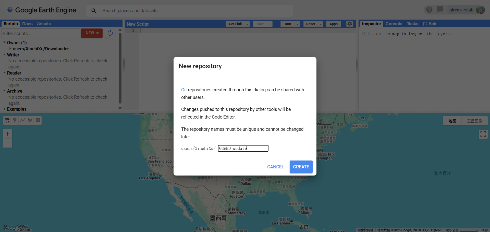
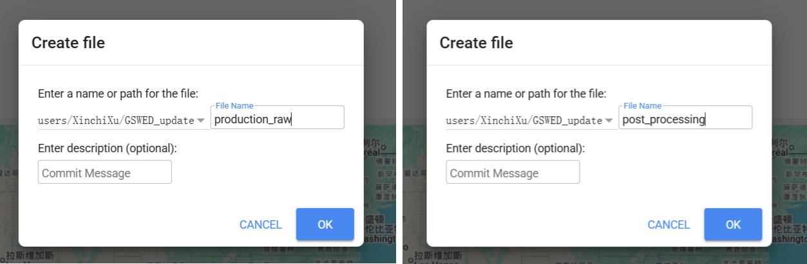
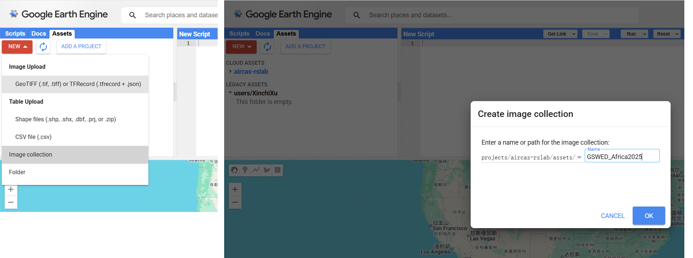
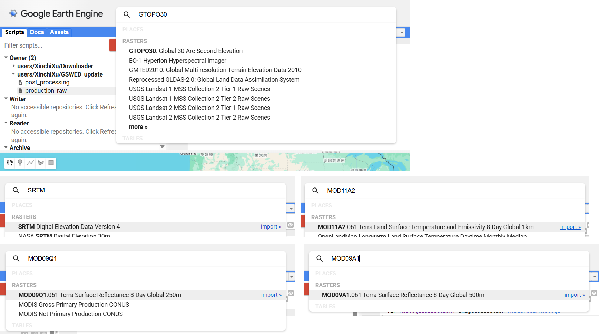
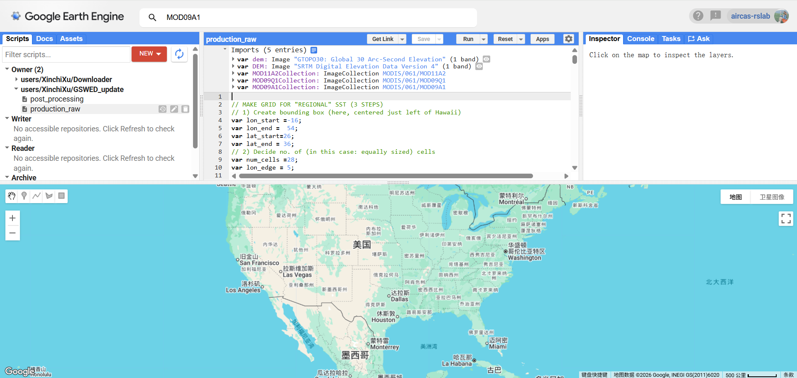
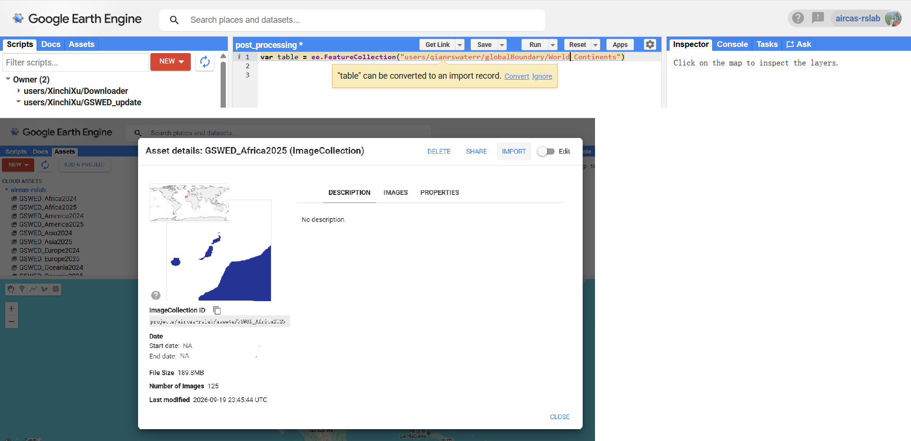
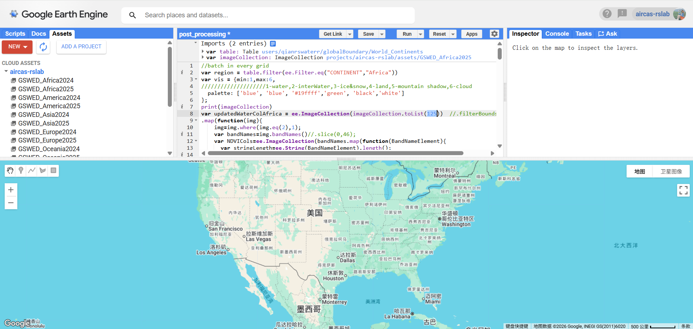

# GSWED（Global Surface Water Extent Dataset）数据集更新

本项目用于将 [GSWED](https://www.scidb.cn/detail?dataSetId=710159544281464832&version=V4) 全球地表水数据集快速更新至目标年份。整个流程分为两段：

1. **本地生成代码**：运行 `UpdateCode.py`，基于基准年份（2023）的代码模板，批量替换日期与资产路径，自动生成目标年份的五大洲生产代码与后处理代码；
2. **GEE 云端执行**：在 Google Earth Engine（GEE）Code Editor 中依次运行生产代码（`production_raw`）与后处理代码（`post_processing`），最终在 Google Drive 中得到目标年份的 GSWED 数据集。

## 目录结构

```
GSWED-update/
├── UpdateCode.py               # 入口脚本：生成目标年份代码
├── 2023更新代码/               # 基准代码（2023 年版本，勿直接改动）
│   ├── Africa/                 # 五大洲生产代码（每洲若干个 .txt，对应不同网格分块）
│   ├── America/
│   ├── Asia/
│   ├── Europe/
│   ├── Oceania/
│   ├── 后处理.txt              # 后处理代码模板
│   └── BandDate2023.xlsx       # 波段-日期对照表
├── {目标年份}更新代码/          # 运行 UpdateCode.py 后自动生成
│   ├── Africa/ … Oceania/      # 已替换为目标年份的生产代码
│   ├── 后处理/                 # 五大洲各自的后处理代码
│   └── BandDate{目标年份}.xlsx
├── assets/                     # 配图
└── reference-old/              # 其它历史交接文档及代码
```

## 准备工作

- **Python 环境**：Python 3.x，并安装依赖：
  ```bash
  pip install openpyxl
  ```
- **GEE 账号**：已注册并可正常访问 [GEE Code Editor](https://code.earthengine.google.com/)。

## 更新步骤

### 第一步：本地生成目标年份代码

打开 `UpdateCode.py`，在 `__main__` 中按需修改 `update_new_code` 的两个关键参数：

| 参数 | 说明 |
| --- | --- |
| `target_year` | 要更新的目标年份，如 `2025` |
| `user` | 你的 GEE 用户名（即资产路径 `users/你的用户名` 中的部分） |

```python
def update_new_code(target_year, folder='./2023更新代码', old_year=2023, user='your_username'):
    ...

if __name__ == '__main__':
    update_new_code(target_year=2025, user='your_username')
```

运行脚本：

```bash
python UpdateCode.py
```

运行完成后，项目下会自动生成 `{target_year}更新代码/` 目录，其中包含：

- 五大洲（Africa / America / Asia / Europe / Oceania）子目录下的**生产代码**（日期、资产路径已替换为目标年份）；
- `后处理/后处理_{大洲}.txt` 五份**后处理代码**（大洲名、年份、资产路径已替换）；
- 更新后的波段日期表 `BandDate{target_year}.xlsx`。

### 第二步：在 GEE 中新建仓库与脚本

1. 打开 [GEE Code Editor](https://code.earthengine.google.com/)，在左侧 **Scripts** 面板点击 **NEW → New repository**，新建一个名为 `GSWED_update` 的仓库（仓库名创建后不可更改）。

    

2. 在新建的 `GSWED_update` 仓库下分别新建两个脚本文件：`production_raw` 与 `post_processing`，前者用于生产原始水体影像，后者用于后处理与导出。

    

### 第三步：创建五大洲的 Image Collection

进入 **Assets** 面板，点击 **NEW → Image collection**，依次创建 5 个影像集合，命名为：

```
GSWED_Africa{目标年份}   GSWED_America{目标年份}   GSWED_Asia{目标年份}
GSWED_Europe{目标年份}   GSWED_Oceania{目标年份}
```

例如目标年份为 2025 时，第一个影像集合命名为 `GSWED_Africa2025`。这 5 个集合用于存放后续生产代码输出的原始水体影像。



### 第四步：运行生产代码（production_raw）

1. 打开 `production_raw` 脚本，在上方搜索栏依次搜索并点击 **import** 引入以下 5 个数据集，并在 Imports 区将变量名改为与代码一致（见下图）：

   | 搜索关键字 | 数据集 | 导入后变量名 |
   | --- | --- | --- |
   | `GTOPO30` | Global 30 Arc-Second Elevation | `dem` |
   | `SRTM` | SRTM Digital Elevation Data Version 4 | `DEM` |
   | `MOD11A2` | Terra LST 8-Day Global 1km | `MOD11A2Collection` |
   | `MOD09Q1` | Terra Surface Reflectance 8-Day Global 250m | `MOD09Q1Collection` |
   | `MOD09A1` | Terra Surface Reflectance 8-Day Global 500m | `MOD09A1Collection` |

    

2. 依次将 `{target_year}更新代码/{大洲}/` 目录下的每个 `.txt` 文件内容粘贴到 `production_raw` 中，**逐个点击 Run 提交任务**。每份代码负责一个大洲的部分网格，任务运行后生产的水体影像会自动写入第三步创建的对应 Image Collection（可在右侧 **Tasks** 面板查看任务进度）。

    

> **提示**：全部生产任务量较大，GEE 处理较慢，建议分洲、分批提交后耐心等待；也可通过提升账号或项目权限来加快任务处理。

### 第五步：运行后处理代码（post_processing）

以下流程以 **非洲（Africa）** 为例，其余大洲重复相同操作即可：

1. 打开 `post_processing` 脚本，粘贴以下代码，并在编辑器弹出的提示中点击 **Convert**，将其转换为要素集合变量：

   ```js
   var table = ee.FeatureCollection("users/qianrswaterr/globalBoundary/World_Continents")
   ```

2. 在 **Assets** 面板中打开 `GSWED_Africa{目标年份}` 影像集的详情页，记录其影像数目（下图示例中 **Number of Images** 为 125），然后点击 **IMPORT** 将其导入脚本（导入后变量名应为 `imageCollection`，与代码中的引用保持一致）。

    

3. 将 `{target_year}更新代码/后处理/后处理_Africa.txt` 的内容粘贴到脚本中，把第 8 行 `toList(100)` 中的 `100` 改为上一步记录的**实际影像数目**：

   ```js
   var updatedWaterColAfrica = ee.ImageCollection(imageCollection.toList(125))  //.filterBounds(geometry)
   ```

4. 点击 **Run** 运行脚本，确认 Console 输出无误后提交任务。脚本会为影像集合中的每一张影像创建一个导出任务，处理完成的 GSWED 目标年份数据集将自动保存到你的 **Google Drive** 的 `GSWED_Africa{目标年份}_4326v2` 文件夹中。

    

> **说明**：后处理代码默认启用 `exportImageColDrive`（导出到 Google Drive）；如需同时导出到 GEE Asset，可取消 `exportImageColAsset` 相关代码的注释并修改其中的资产路径。

## 常见问题

- **运行 `UpdateCode.py` 报错 `FileNotFoundError`**：请确认在项目根目录下运行，且 `./2023更新代码` 目录完整存在。
- **后处理运行结果缺影像**：`toList()` 的参数必须不小于影像集合的实际影像数目，否则部分影像不会参与后处理。
- **任务长时间排队**：GEE 免费账号并发任务数有限，请分批提交生产任务，或错峰运行。
